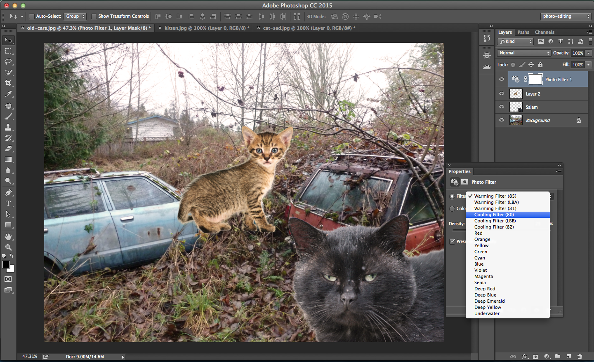

#Advanced techniques
_Salem sent the photo to her mother, and apparently the last image did not deceive her at all! She threatened to come visit Salem. Salem, in an appeal to her mother, is planning on sending a Photoshoped file using more Advanced techniques in hopes that the resulting photo is more believable._

_Lets begin by opening a photo Salem took with her shiny new camera. Salem doesn't have a tripod for her new camea, so she was unable to include herself in the photo without any friends to take the picture of her!_

Open `old-cars.jpg`.

_Salem was able to take a selfie, however, that we can transplant into the photo of the old cars._

Open `cat-sad.jpg`.

__Cropping__: Select the `Crop Tool (C)`. Drag the edges to get rid of the black border in this photo. You can either preserve the cropped pixels or remove them by toggling the `Delete cropped Pixels` button. We will delete the pixels this time. Press `Enter` to finish cropping the photo. 

##Remove the background
__Clipping masks__: This time we will cut out the cat from the background of the photo, but allow for more precise adjustments of the selection over time. 

Use the `Quick Selection Tool (W)` to select Salem. (You can also select the white background and invert the selection).

Click the `Edit in Quick Mask Mode` button. This mode will create a 'mask', which shows the unselected area in red, and the selected area without. You can paint on the image with the brush tool to add or subtract from the mask (or selection). Paint in black to deselect, and erase to select.

You can use different kinds of brushes in the mask refinement process. Use a bristle brush to refine the selection of the fur.

Now we will create a more permanent mask to represent the selection. Select the `Add mask` button.

A mask has been created on this layer that 'masks' the areas shown in black in the mask thumbnail. We can edit the mask of this layer by selecting the mask layer and painting with a brush in black to deselect. Erase in black to select. 
Select the layer with the cat and click the dropdown to select `Duplicate layer`. Rename the layer to `Salem` and duplicate it to `old-cars.jpg`. Doing this will preserve the mask ok the layer.

_Now we'll add another furry friend to the mix._ 

__Background eraser__:   

Open `kitten.jpg`. We will use another method of background removal for this kitten. 

Create a new layer and fill it with black. Make sure this layer is underneath the layer with the kitten. We will use this layer to test the effectiveness of the background removal process. 

Hold down on the `Eraser Tool` to reveal the `Background Eraser Tool` and select it. 

Change the size of the brush to a very large size (450px is good). Make sure caps lock is off, it will change the appearance of the cursor. We will be testing and adjusting tolerance if needed, but 15%-20% is a good number to begin with. 

Aim the center of the cursor in the background while the edge overlaps the kitten and click, which should erase part of the background.  

Continue to erase the background in this manner, adjusting the tolerance for the chest area as needed. Your final result might look something like this:

__Channel mask (alpha matting)__:    

__Magnetic lasso tool__:

##Adjustment layers

Paste Salem (`cat-sad.jpg`) into `old-cars.jpg`. Rename the layer "Salem". Move her into the corner with the move tool. 

Paste the kitten we just cut (`kitten.jpg`) out into `old-cars.jpg`. Rename the layer if desired.

Unlike Salem, the kitten has a warm color tone to it. We should try to filter the image in order to make it match the drearyness of the background. 

We'll use an __adjustment layer__ to accomplish this change:

>An adjustment layer applies color and tonal adjustments to your image without permanently changing pixel values. For example, rather than making a Levels or Curves adjustment directly to your image, you can create a Levels or Curves adjustment layer. The color and tonal adjustments are stored in the adjustment layer and apply to all the layers below it; you can correct multiple layers by making a single adjustment, rather than adjusting each layer separately. You can discard your changes and restore the original image at any time.

[Adobe: Adjustment and Fill Layers](https://helpx.adobe.com/photoshop/using/adjustment-fill-layers.html)

Click the "Friend 1" layer. Click on the tiny half white, half black circle in the bottom of the `Layers` panel and select `Photo filter`.

Right click on the adjustment layer and select `Create clipping mask`.

Now the kitten matches the cool tone of the background. We can now `transform` the kitten to place it on top of the blue car in the background, 

##Filters and smart objects

We can add a little blur in order to make the cat look more like it belongs in the image. However, unlike last time we used a filter, there is a way to make the filters applied editable. We can instead use __Smart Objects__:

>Smart Objects are layers that contain image data from raster or vector images, such as Photoshop or Illustrator files. Smart Objects preserve an image's source content with all its original characteristics, enabling you to perform nondestructive editing to the layer.

[Adobe: Create Smart Objects](https://helpx.adobe.com/photoshop/using/create-smart-objects.html)

Right click on the layer and select `Create smart object`.

Add a blur filter (`Filter > Blur > Gaussian blur`)

Next, we can add a little shadow around the kitten's feet. Create a new layer and use a low opacity brush in black to add a little darness around the cat's feet. 

##Healing tools

_Salem is feeling a bit self concious about her selfie. She want's to get rid of some of the white blemishes on her face._

If we focus on Salem's face, we can see there are a few bits of snow from the other photo on her face. We can use the `Spot Healing Tool` to remove the bits of ice easily. The `Spot Healing Tool` samples the surrouding pixels in order to remove any blemishes present. 

Select the `Spot Healing Tool`.

Increase the size of the brush to cover the entire size of the spot to be healed plus more.

"Heal" all of the spots until Salem's face looks much cleaner. 

We can also use the `Healing tool` to have more precise control over the pixels sampled to heal the image. 

Zoom in on the rust on the blue car. Select the healing tool. 

Hold `Ctrl` and click above the white line on the car. This will sample the pixels you want to use in healing the car. Click and drag the cursor over the white line. We can repeat this process until the line is erased away. 

_Salem wants to insert more friends, but can't find any more pictures of decent kittens. She needs to find a way of duplicating the two cats already in the picture._

Duplicate the Salem layer and scale it downward to fit inside the blue car to the left. Rotate it a little to fit inside the square outline of the car. We can reflect across the center horizontally by typing a minus sign `-` in the `W` value in the top toolbar.

We can change the blendng mode of this layer to make it appear that the cat is _inside_ the car. 

After reducing the opacity and adding a layer mask, it appears as though there is another cat inside the car.

We can multiply the friends to fit into the cars. 

_Salem is satisfied with this image! She will send a follow up image to her mother to prove she indeed has friends._
