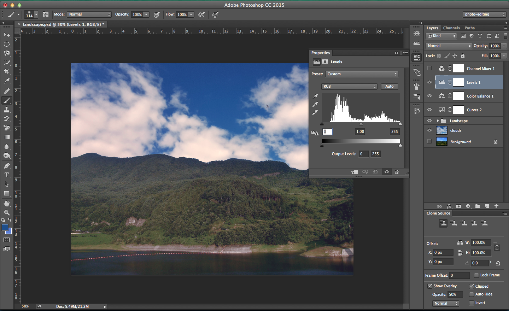
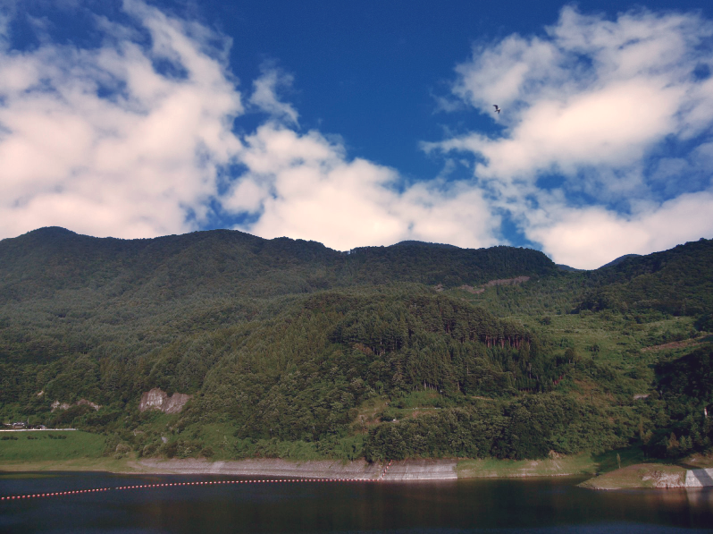

#Strategy

Every unique image modification requires a context-specific strategy. Below are a few examples of choosing context-specific tools and methods to accomplish different effects. 

##Removing things

When removing objects from an image, ask yourself these questions to determine the optimal tool to use. 

###Select area for removal

First, in order to remove an object, we must first select it. 

Questions to ask when selecting objects:
- Is the object on a solid, colored background? _Use the background eraser tool._
- Are there objects overlapping the object you wish to remove? _Use the pen tool._
- Does the object have complicated edges of different textures? _Use a quick mask to refine the selection._

__Always remember to duplicate your layer before using destructive tools like the background eraser tool__

Lets remove the cat and the dog from the cannon. 

####Selecting precise edges: pen tool

Use the pen tool when you need to erase along a straight edge. 

[Video: How to Remove Anything from a Photo in Photoshop](https://youtu.be/ifhEx4adAa8?t=77)

Make a selection with the pen tool :

Note: We can save these paths (they won't be retained if they stay defined as the _work path_) to reselect areas on the image later to retain the sharp edges of the cannon.

[Video: How to Use the Pen Tool in Photoshop](https://www.youtube.com/watch?v=6WJj6iNr6K0)

###Remove the pixels

Next, after selecting the object we want to remove, we need to choose the set of tools we are going to use. 

Questions to ask when removing pixels:
- Am I removing pixels at the edge of an object, or wanting to erase a distinct (differently colored) object? _Use the clone stamp tool._
- Is the object surrounded by a large area of similarly patterned areas (such as a sky/landscape, or textured surface)? _Use content-aware fill._
- Are we removing small blemishes from an image (pimples, imperfections, dust, etc) while maintaining texture and color? _Use Spot Healing Brush or Healing Brush._ 

__Remember to always work in a new layer when working with tools like the Healing Brush or Clone Stamp.__

####Get the clone process started: Content-Aware Fill

The `Content-Aware Fill` tool is great for beginning the removal process of certain items. Still, it doesn't work for all cases:

[Video: Content-Aware Fill](https://www.youtube.com/watch?v=rmWHeyU6JxI)

However, we can easily clean this up using the `Clone Stamp Tool` and then the `Healing Brush Tool`

Next, we can paint in the inside of the cannon by first selecting an elipse and transforming the selection to fit inside the cannon. 

We can use the `Eyedropper Tool (I)` to select a black from the cannon's inside that is already exposed and paint it in. 

We can then use the `Clone Stamp Tool` to add some imperfections to the cannon's edges, and to clean up the rest of the 

Now we can fill in the rest of the cannon area using the clone stamp tool.

##Adding things

Creating an image composite from two different images can be a color and lighting matching challenge. Adjustment layers and the `Overlay` blending mode are two great ways to ensure successful image compositing. 

An ideal strategy first attempts to match the lighting across both images using the adjustment layers _Curves, Levels, and Brightness and Contrast._

Next, the colors are adjusted for each part of the image using the adjustment layers _Hue/Saturation, Color Balance, and Photo Filter._ Other adjustment layers can also help.  

Lets replace the sky from this image with the sky of another image:

We can use these clouds as the new sky:

First we can use the `Quick Select` to remove the original sky from view by using a layer mask. Then, we can copy/paste the clouds into the background:

###Does my composite match? 

There are a number of steps we can take to ensure the two images combined are blending well.

[Video: Bring Composites Together With Color in Photoshop](https://www.youtube.com/watch?v=UO4FCwO6hXc)

__Check the lighting.__ Create a channel mixer adjustment layer. Check the monochrome box, so that the image is only black and white. If any adjustments need to be made, this edit should make that apparent. We can add `Levels` or `Curves` adjustment layers to fix this issue if needed.

Add a curves adjustment layer to the background to reduce the contrast of the foreground.

Before:

After:

Final result:

__Make sure the background saturation matches the saturation of the foreground.__ Create a `Hue/Saturation` layer, check the `Colorize` box. 

The layer is retaining too much color, and we should let a little of the original color to show through. Right click the adjustment layer and navigate to `Blending Options`. In the `Blend if` section, adjust the `Underlying layer` sliders to allow more/less blue to show. 

 
We can also add colored lighting where necessary. Create a new layer, use the `Eyedropper Tool` to select colors from the foreground/background, and paint where colored lighting is needed. Change the blending mode of this layer to `Soft Light` so that it matches the lighting of the layer it's applied to.  

__Color matching with `Curves`__: Use the `Curves` adjustment layer to change the prevalence of different colors in a layer.

[Video: Quick And Easy Compositing! In Adobe Photoshop](https://www.youtube.com/watch?v=5qKbf9AFnt4)

__Blend everything together__: Add a couple of adjustment layers over the whole image to improve the blending of the two together. Add a `Color balance` adjustment layer, altering the highlights and shadows.

Add a `Levels` adjustment layer to add a little bit of blue to the shadows and some yellows to the highlights. 

Finished.

======

[< Home](README.md)
