#Example: Transplanting a doll

Open the photo of the doll.

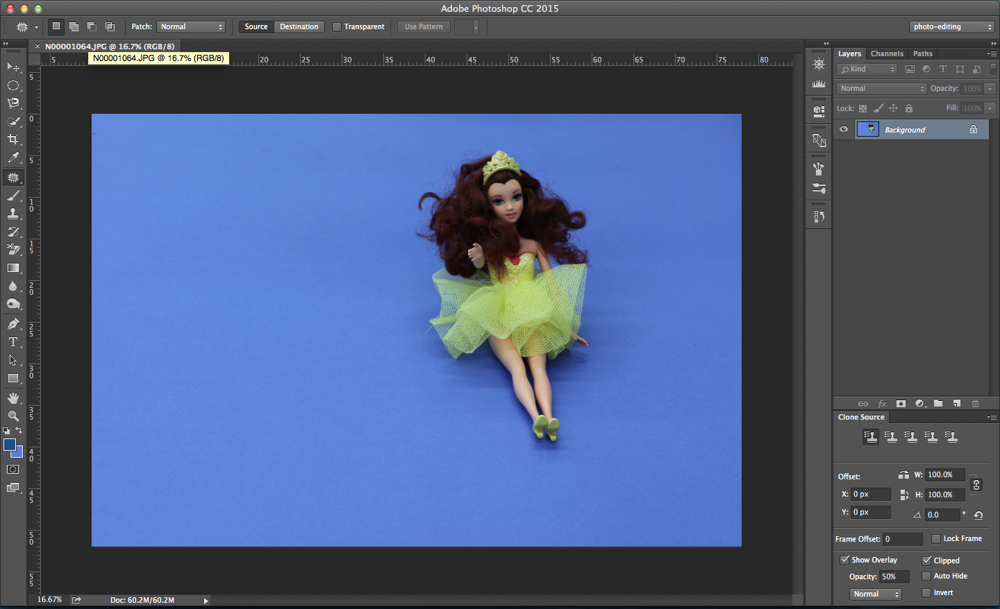

Select the background eraser tool. 

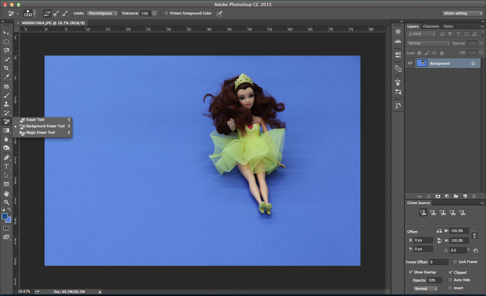

Change the background layer to a normal layer. Create a layer underneath with a color that will contrast well (such as yellow).

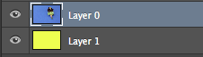

Use the background eraser tool to erase the background. A tolerance around 50% was usually sufficient. 

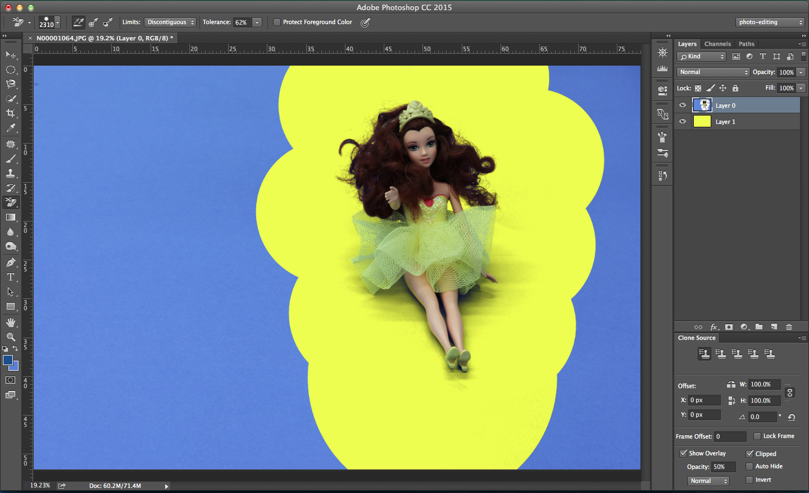

Open the image of the table with the red cube. 

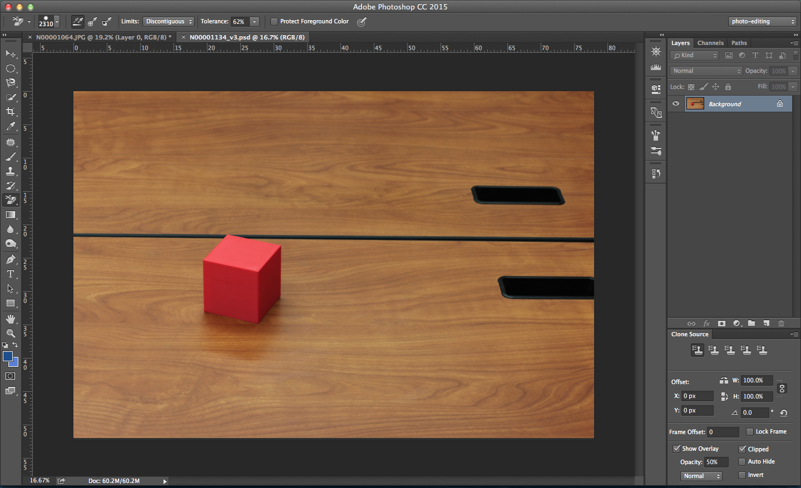

Copy the doll into the red cube picture. 

Create a channel mixer adjustment layer and check the box "monochrome" to view whether the lighting of the composite matches. In this case, it mostly matches.
 
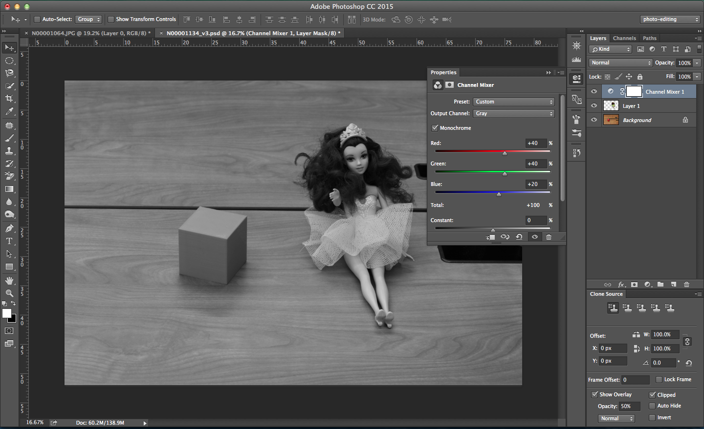

Create more adjustment layers for the doll to fix the blue tint. 

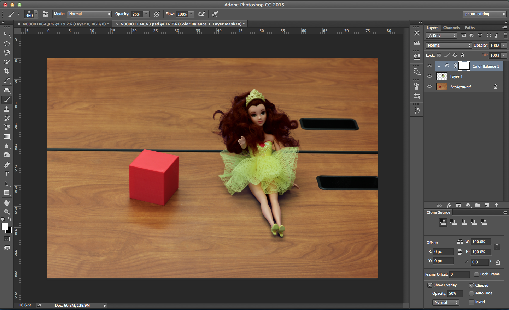
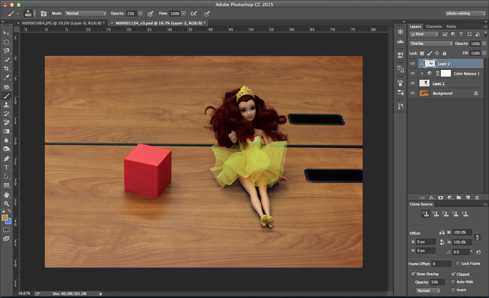
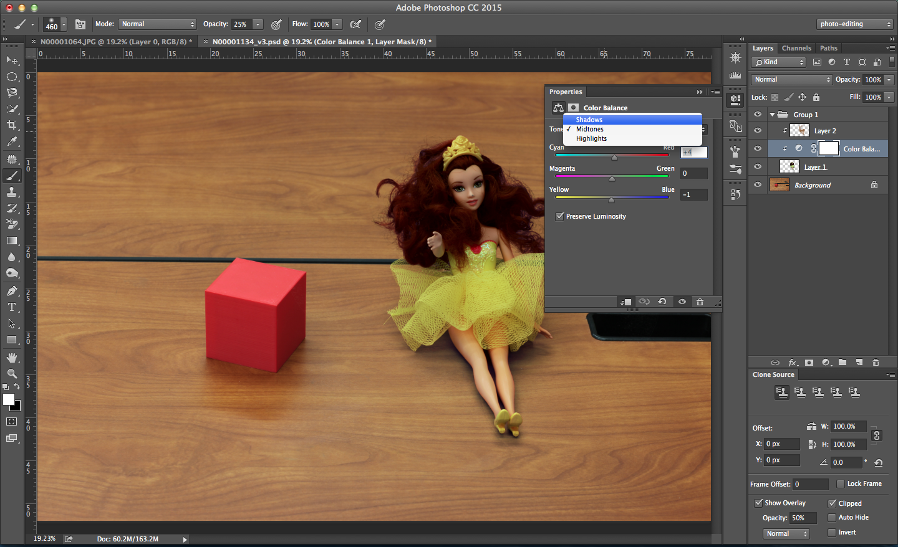

Group the doll and its associated adjustment layers. 

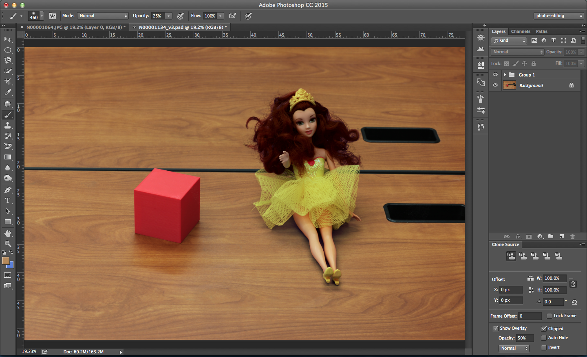

Create some adjustment layers to unify the composite. I used Color Balance to increase the blue in the shadows and increase red in the highlights. Levels was used to increase the contrast, and Curves to further adjust the brightness and contrast. 

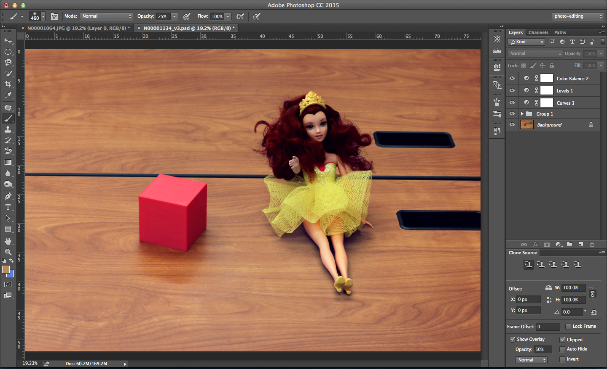

The composite is finished!  

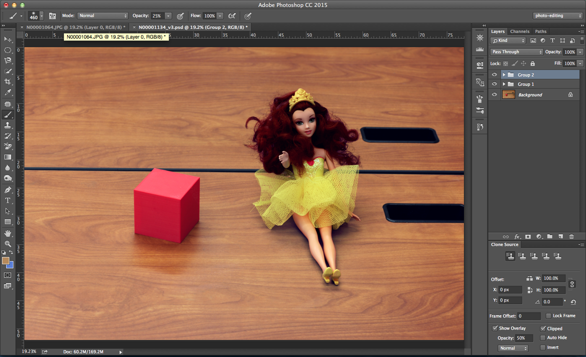