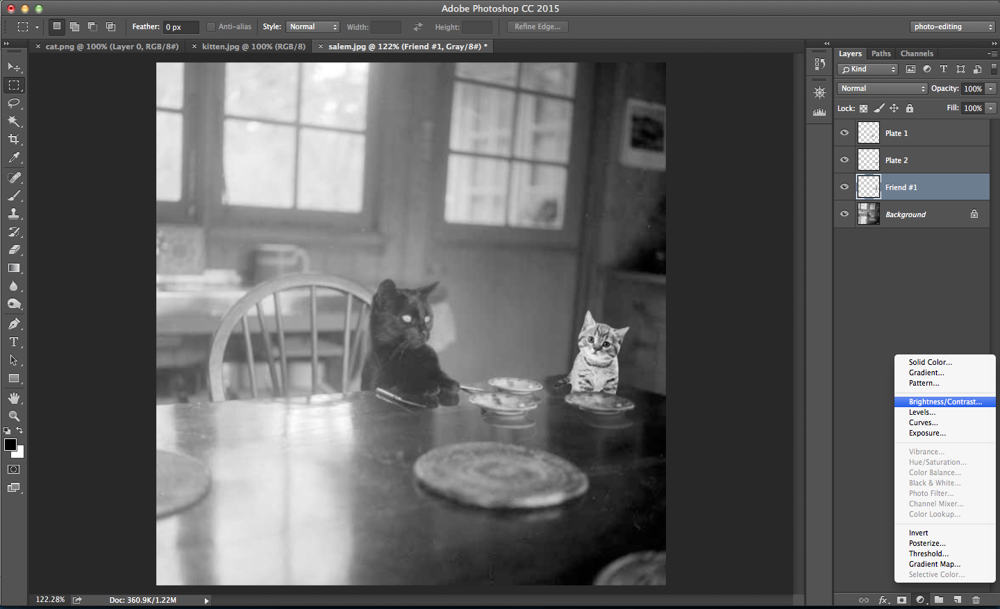

#Getting started
_Basic Photoshop techniques_

_Salem the cat is loney at dinner. Her mom is concerned Salem isn't making any friends, and is asking Salem to send her a picture of her and her friends. Salem wants it to appear like all of her friends join her for dinner._

First, lets open Photoshop and customize the workspace.

##Workspace
Customize the workspace by hiding and showing panels.

_Salem's paws are very nubby and sometimes she inadvertently selects the wrong panels in the workspace. In order to avoid this, Salem wants to close as many unnecessary panels as she can._

__Hiding panels__ : Right click on a panel and choose `Close`

__Showing panels__: Click `Window` and select a panel to show (Layers, etc.)

_The navigator panel has appeared_

__Saving a workspace:__ Click `Window > Workspace > New Workspace`. Name and save your workspace.

We're ready to open an image. 

_Salem has taken a photo of herself eating dinner that she would like to photoshop friends into. Lets open it up._

__Open an image:__ Click `File > Open` or `Ctrl + o`. Open `salem.jpg`.

##Zooming and navigating an image

__Show the navigation panel__: Click `Window > Navigatior`

__Zoom in__: Select the zoom tool (Z). Click on the place you want to zoom into.

__Navigate with navigation panel__: Drag on the `Navigation` pane to navigate around the image.

__Hand tool__: Press `H` or click the hand icon on the left toolbar. Drag to navigate with the hand tool.

__Automatically fit an image to the window__: `cmd + 0` or `View > fit on screen`

##Basic techniques
_In order to make it seem like Salem has some friends, we are going to copy and paste some kittens into this lonely photo of Salem that we found on Google Image search._

###Copy/move (within same image)
_First we want to create more places for Salem's friends to eat. We'll copy the plate that's already on the table._

1. There are a few ways to do this. We can use the `Quick Selection Tool (W)`, `Magic Wand Tool (W)`, or the `Lasso Tool`. Select the plate using the `Quick Selection Tool`.

Copy and paste the plate (`Ctrl-C` and `Ctrl-P`, alternatively `File > Copy` and `File > Paste`). This will create a new layer.

Since the new plate is its own layer, we can drag around the plate without affecting the _Background_ layer. We can rename this layer "plate 1"

2. Select the `Move tool (V)`. Drag the plate downward. 

3. There are extra pixels on the edges of the plate. We can use the `Eraser Tool (E)` to erase the extra information. There is a better way to manage selections (layer masks) which will be covered later.

Edit the brush settings to suit the size of the plate.

Zoom in on the plate and erase the extra information. 

4. The plate still looks weird. Use `Transform (Ctrl + T)` to scale the plate up to match the perspective of the image. 

5. Lets use the `Burn Tool (O)` to add more imperfections to help the second plate blend in. This will darken the pixels in the plate, like we have "burned it."

6. Try to add a third plate.

###Copy/paste (between different images)
_We're ready to add in some friends. First we should open the cat photos in new tabs._

1. Open `cat.png`. 
2. Select all `Ctrl + A`, copy `Ctrl + C`.
3. Navigate to `Salem.jpg` and paste `Ctrl + P`. 

Notice how the cat we have copied into the image is grey. This is because the color mode of `Salem.jpg` is Grayscale. We can view this in `Image > mode`.

4. Resize the cat and order it underneath the plates.
5. There is a little white on the outline of the cat. Lets try to remove that using the `Refine Edge tool`. First hold `cmd` while clicking the cat layer's thumbnail. This should select the outline of the cat layer. Click the `Refine Edge` button on the top toolbar. We can add a little feather to the outline and shift the edge inward a little bit.

Invert the selection using `Cmd + shift I` and delete. 

###Noise restoration
_Salem's friend still looks professionally photographed (Salem only has his grandma's camera to take photos of herself. We'll need to add noise to Salem's new friend to make this image more believeable.)_

1. First, we will edit the colors in the photo. We can add an bightness/contrast adjustment layer. Adjustment layers are useful because they can be edited and re-edited at any point. 

2. We'll create a clipping mask so that the adjustment layer will only affect the layer with the kitten beneath it. 

Now we can make the kitten layer more grey.

Lets also apply a blur filter to make the kitten blend a little better with the image.

3. Lets add another layer to add some shadows to the kitten. Be sure the new layer is below the adjustment layer, and also has an arrow indicating it is a clipping mask. 

We've selected a brush with 0 hardness in a black color, using the mode "darken".

4. We can now combine these layers in a group. First, select all the layers. Then, select the folder icon at the bottom of the layers pane.

5. If we wanted to take things a step further, we could have saved the file we copied `cat.png` in a low quality .jpg format in order to mimic the jpeg artifacts in salem's original photo.

###Add a reflection

Now, lets add a reflection to the image in order to add even more realism. First, we can copy the group of layers that comprise the kitten. Then, we can transform the entire group of layers, rotating them 180 degrees. 

Then, we need to change the blend mode of the kitten layer. We can change it to overlay, so it blends in and matches more closely the pattern of the table. We can also bring down the opacity of the layer to make this effect more subtle.

###Remove objects

_Salem realizes the coaster her mother had been asking Salem to return is in the front and center of the table! Rather than crop the photo, Salem decides to remove it using Photoshop Magic._

1. Double click the background layer in order to convert it to a regular layer, "layer 0".

2. Select the patch tool. Click and drag around the coaster. The technique for removing objects will vary from case to case. In this instance, we can get away with continuously patching the area vertically to match the reflection from the window behind. 

Use the `Blur Tool` too smooth out the resulting patched area.

###Add more noise
Finally, we can add a noise filter to try to uniformly distort the image. 

1. Create a new layer `Cmd + shift + N` at the top of the layers. Name it noise. Select "Overlay" for the Mode and check the box "Fill with Overlay-neutral color (50% grey)". 

2. Go to `Filter > Noise > Add Noise` to bring up the Add Noise dialog. Select 10% under Amount and Gaussian under Distribution. Click ok. 

3. Reduce the opacity of this layer to 40%. 

_Finished! Salem will send the photo to her mother._

======

[Advanced Layer Tasks >](2_advancedtechniques.md)